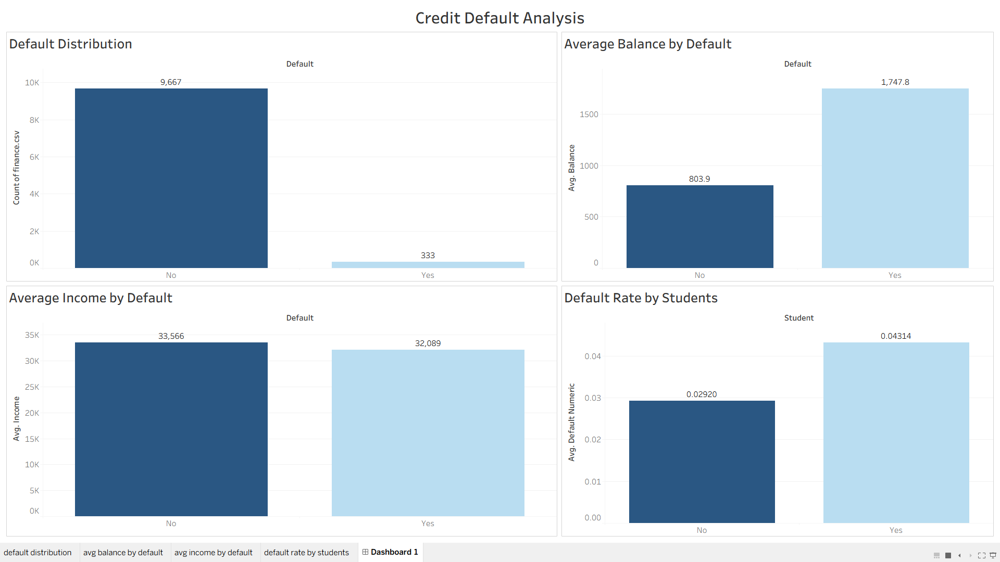

# Credit Default Analysis

## Project Overview
This project analyzes customer credit default behavior using Python, SQL, and Tableau on a financial dataset.  
It aims to identify patterns and key factors that contribute to higher default risk.

## Tools & Technologies
- Python
- SQL
- Tableau

## Dataset
- Contains customer information such as:
  - Balance
  - Income
  - Student status
  - Default status

## Key Insights
- Only ~3.3% of customers defaulted, indicating strong class imbalance  
- Customers who default have significantly higher average balance (~1747 vs ~803)  
- Average income is similar for both groups, so income is not a strong predictor  
- Students have a higher default rate (~4.3%) compared to non-students (~2.9%)

## Dashboard

## Project Files
- `finance.ipynb` → Data analysis in Python  
- `finance.csv` → Dataset from Kaggle
- `dashboard2.png` → Tableau dashboard  

## Conclusion
Higher balance is the strongest indicator of default risk.  
This analysis can help financial institutions better assess credit risk.
